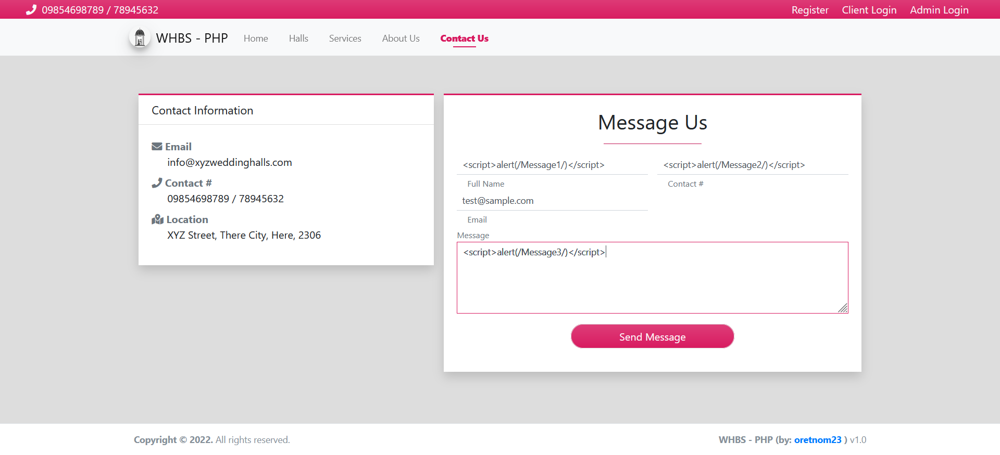
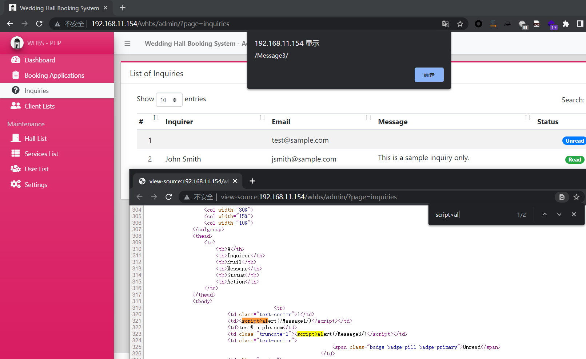
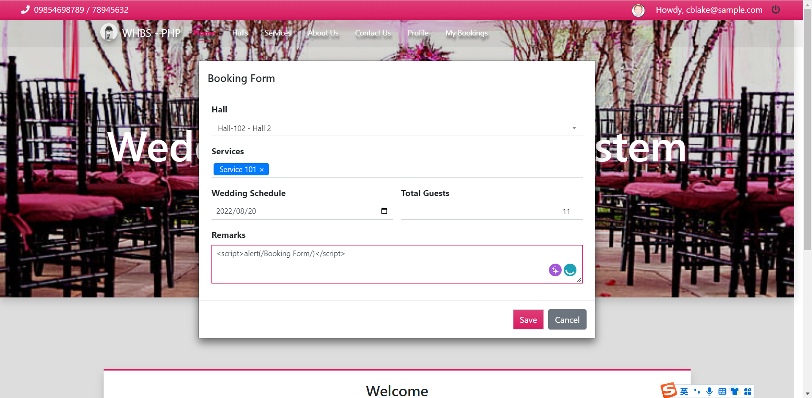
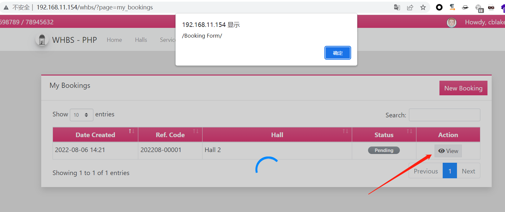
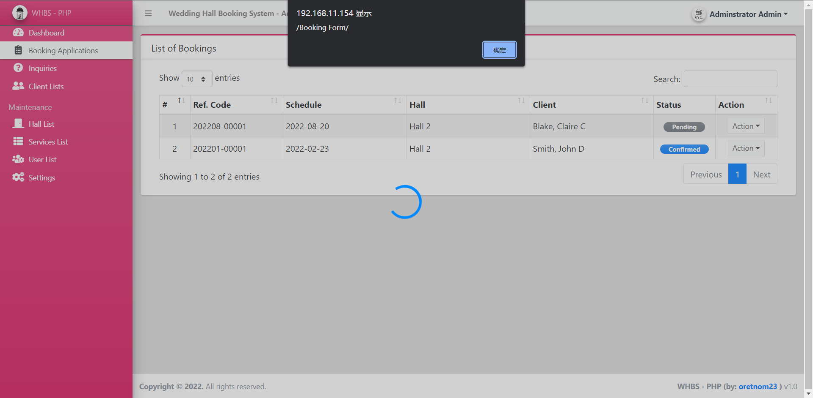
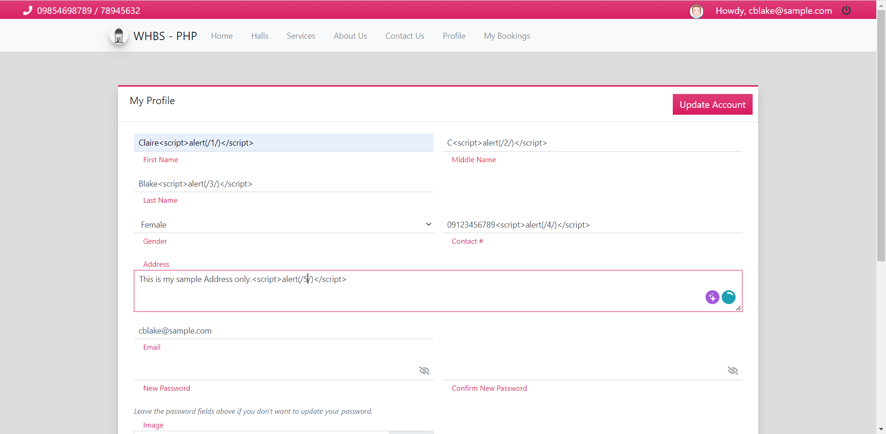
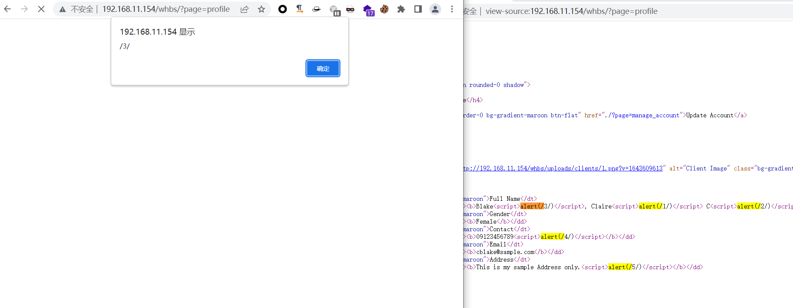
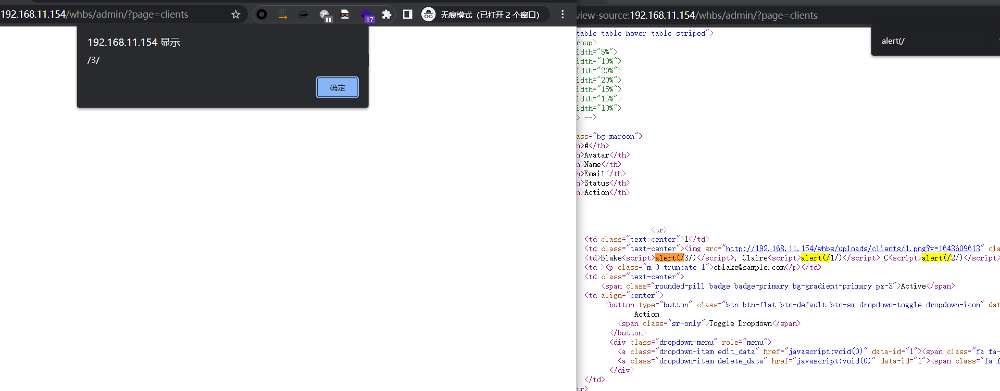
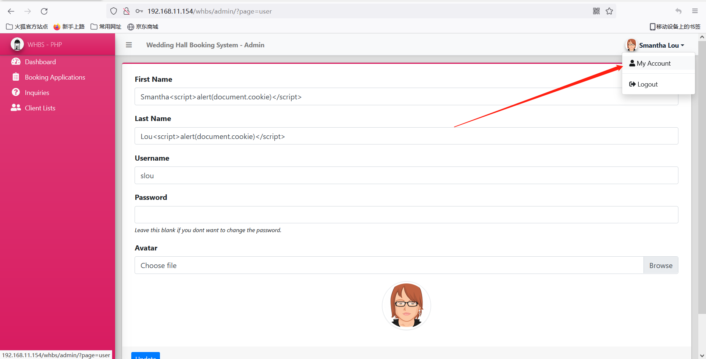
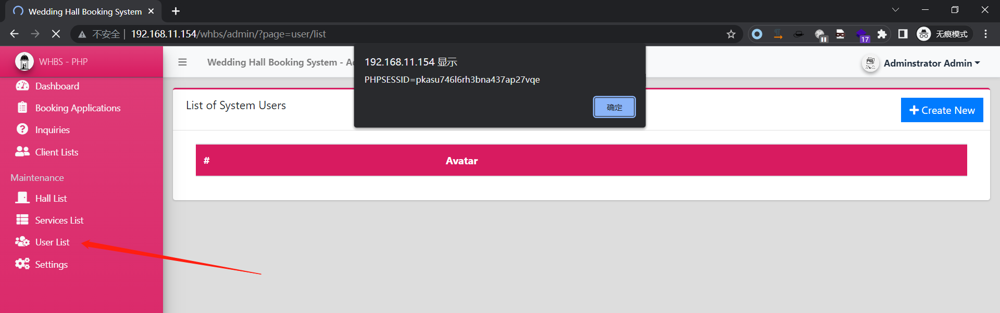

# WHBS-XSS

The Wedding Hall Booking System published in SourceCodester has multiple Cross-site scripting vulnerabilities. The system does not do anything with input and output. Attackers can construct malicious code to steal user and administrator cookies.


## Contact Us

```
/whbs/?page=contact_us
```






## Booking Form



Fires when the user views the booking

```
/whbs/?page=my_bookings
```



Fires when the admin views the booking

```
/whbs/admin/?page=bookings
```




## Profile page

Modify the profile

```
/whbs/?page=manage_account
```



Fires when the user views the profile

```
/whbs/?page=profile
```



Fires when the admin views the Client Lists

```
/whbs/admin/?page=clients
```




## Staff user profile

```
/whbs/admin/?page=user
```



Fired when an administrator visits the User List page.

```
/whbs/admin/?page=user/list
```



All of the above vulnerabilities can return cookies.


## Link

https://www.sourcecodester.com/php/15154/wedding-hall-booking-system-phpoop-free-source-code.html